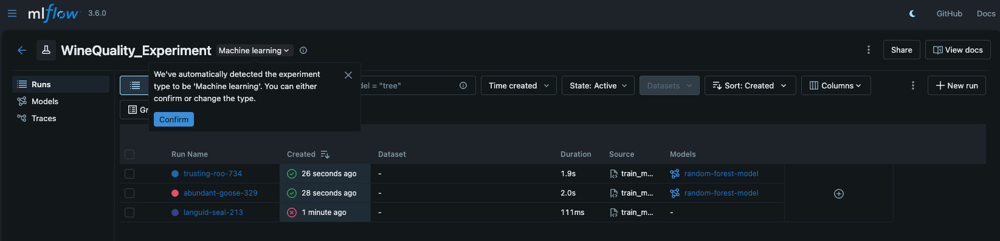
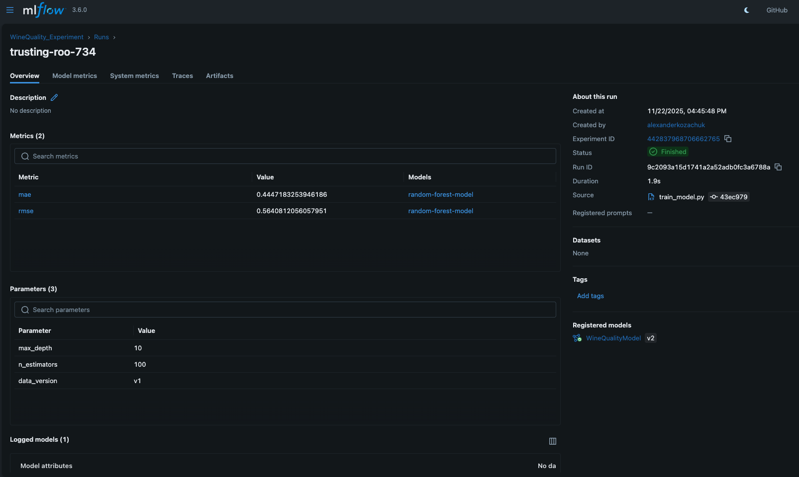
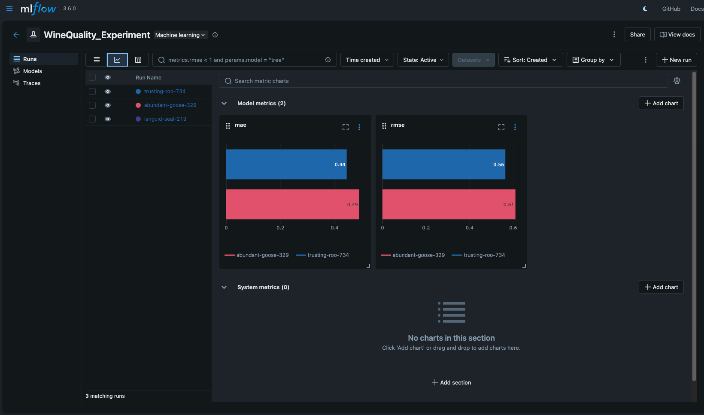
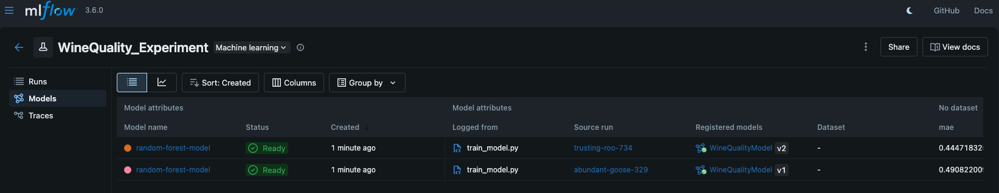

# Отчет по ДЗ 2: Версионирование данных и моделей

## 1. Версионирование данных (DVC)
В качестве инструмента выбран **DVC**.
- Инициализирован DVC в проекте.
- Настроен `local remote` по пути `/tmp/dvc-storage` (симуляция S3 бакета).
- Датасет `wine-quality.csv` добавлен под контроль DVC.
- Файл `.dvc` закоммичен в Git.

## 2. Версионирование моделей (MLflow)
В качестве инструмента выбран **MLflow**.
- Реализован скрипт `src/models/train_model.py`.
- Используется `mlflow.log_param` и `mlflow.log_metric` для трекинга.
- Используется `mlflow.sklearn.log_model` для сохранения артефактов модели.
- Настроен **Model Registry**: модель регистрируется под именем `WineQualityModel`.

Скриншот MLflow UI (Comparison):



Скриншот MLflow Models (Registry):



## 3. Воспроизводимость
- Зависимости зафиксированы в `uv.lock`.
- Dockerfile обновлен для поддержки git и запуска скриптов.
- Для запуска обучения в докере:
  ```bash
  docker build -t ml_project .
  docker run -v $(pwd)/data:/app/data ml_project uv run src/models/train_model.py data/raw/wine-quality.csv
