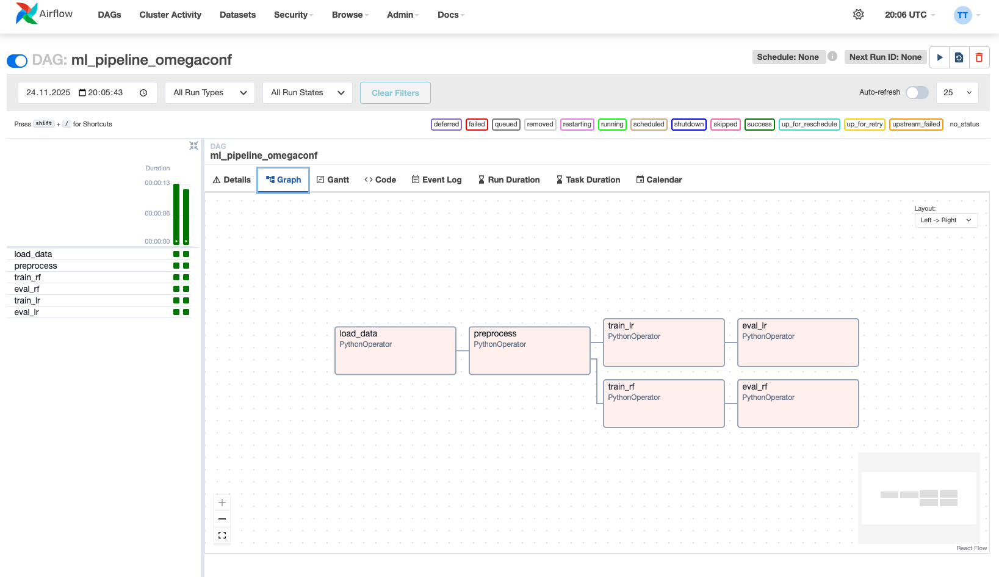
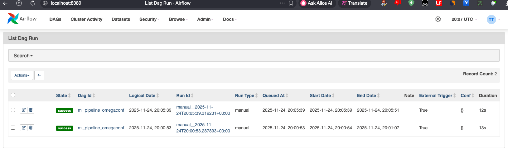
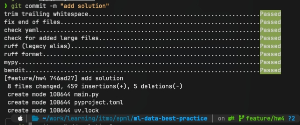

# Отчет по ДЗ 4: Автоматизация ML пайплайнов
## 1. Выбор инструментов

В соответствии с требованиями задания были выбраны следующие инструменты:

1.  **Оркестрация: Apache Airflow**.
2.  **Управление конфигурациями: OmegaConf**.
3.  **Среда выполнения: Docker + uv**.

---

## 2. Настройка инфраструктуры (Docker)

Для реализации требований по воспроизводимости была настроена инфраструктура на базе Docker Compose.

### Ключевые особенности настройки:
*   **PostgreSQL:** Вместо стандартной SQLite подключена база данных PostgreSQL. Это необходимо для работы `LocalExecutor`.
*   **LocalExecutor:** В Airflow настроен `LocalExecutor`, который позволяе

### Результаты

