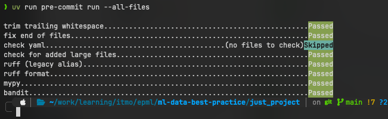

# Отчет по ДЗ 1: Настройка рабочего места Data Scientist

## 1. Структура проекта
Проект создан с помощью **Cookiecutter** и шаблона `cookiecutter-data-science`.
Выбрана структура, обеспечивающая разделение данных (`data/`), исходного кода (`src/`) и ноутбуков (`notebooks/`).

## 2. Управление зависимостями
Использован инструмент **uv**.
- Создан `pyproject.toml` с фиксированными версиями.
- `uv.lock` гарантирует воспроизводимость.
- Для активации окружения: `source .venv/bin/activate` или использование `uv run`.

## 3. Качество кода
Настроены инструменты в `pyproject.toml` и `pre-commit`:
- **Ruff**: Используется как линтер (замена Flake8, isort) и форматтер (замена Black).
```yaml
  - repo: https://github.com/astral-sh/ruff-pre-commit
    rev: v0.14.6
    hooks:
      - id: ruff
        args: [ --fix ]
      - id: ruff-format
```
- **MyPy**: Статическая типизация.
```yaml
  - repo: https://github.com/pre-commit/mirrors-mypy
    rev: v1.18.2
    hooks:
      - id: mypy
        exclude: ^docs/
        additional_dependencies: [click]
```
- **Bandit**: Проверка безопасности.
```yaml
  - repo: https://github.com/PyCQA/bandit
    rev: 1.9.1  # Обновим версию до свежей
    hooks:
      - id: bandit
        args: ["-c", "pyproject.toml"]
        additional_dependencies: ["bandit[toml]", "pbr"]
```

Скриншот работы pre-commit:


## 4. Docker
Создан Dockerfile, использующий `python:3.12-slim` и `uv` для быстрой установки зависимостей в контейнере.

## 5. Git Workflow
- Репозиторий инициализирован.
- Настроена ветка `hw1`.
- Настроен `.gitignore`.