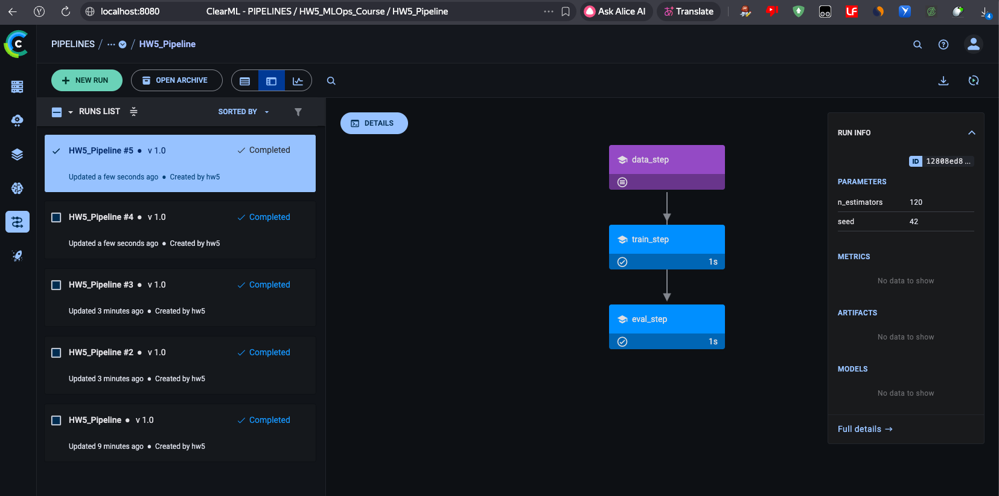
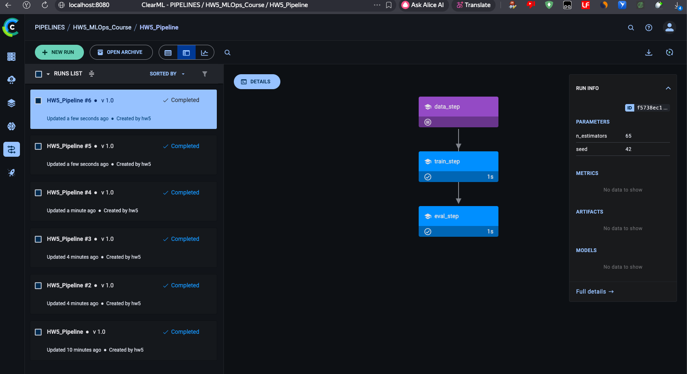
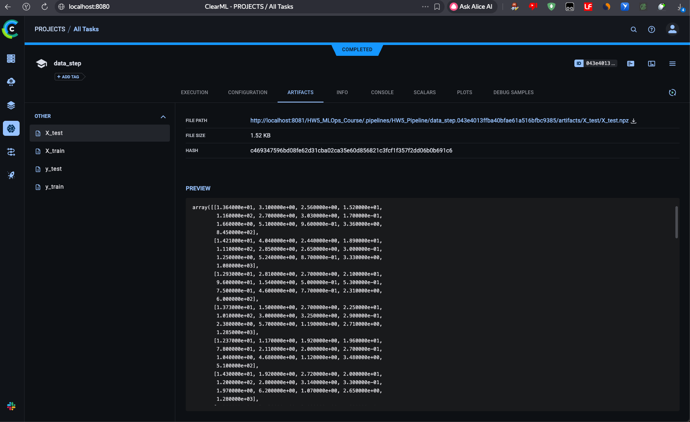
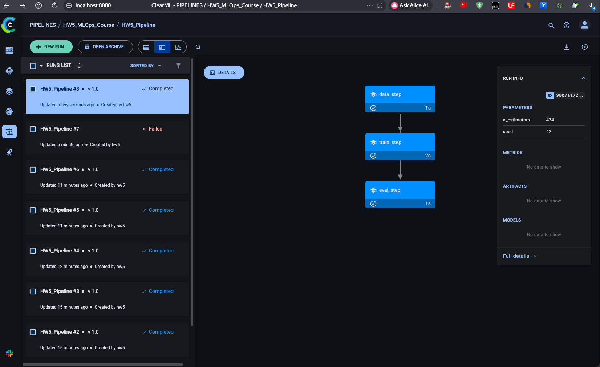
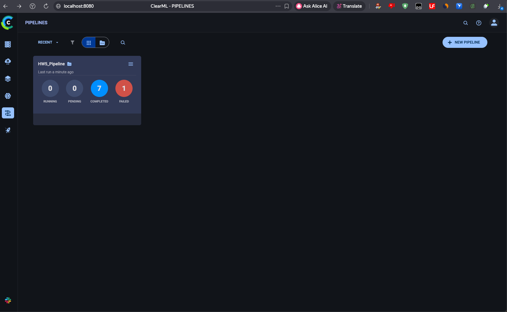
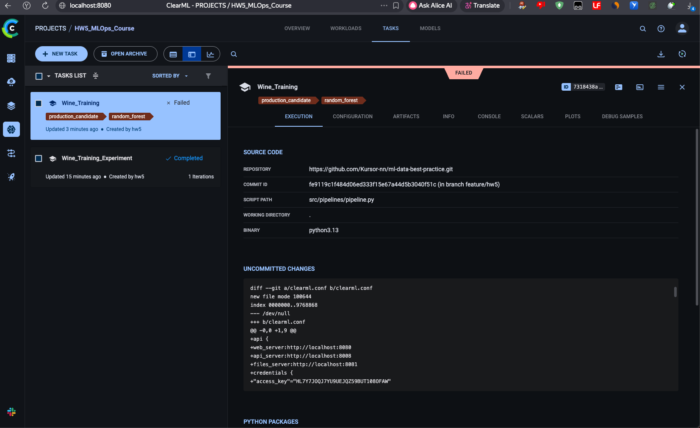
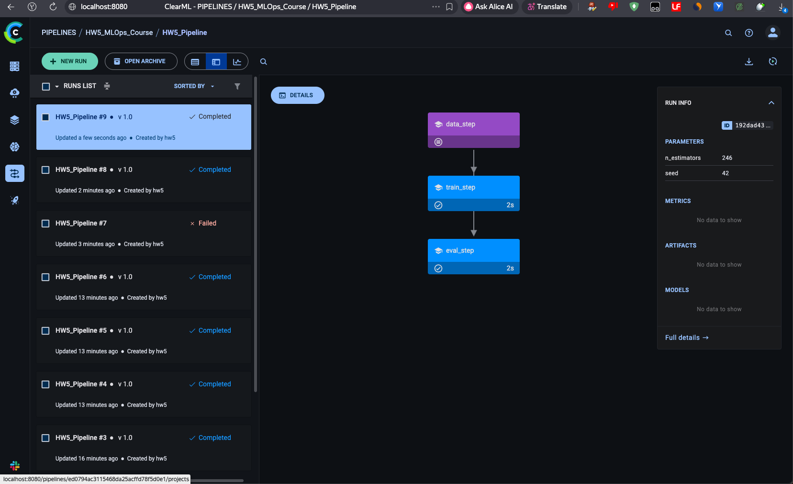
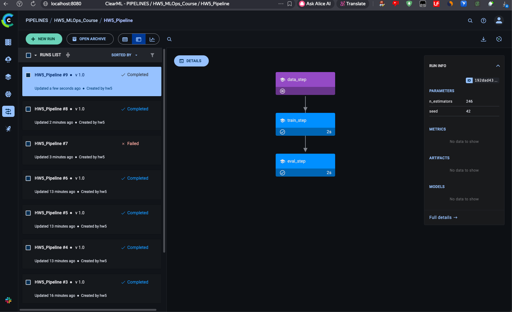
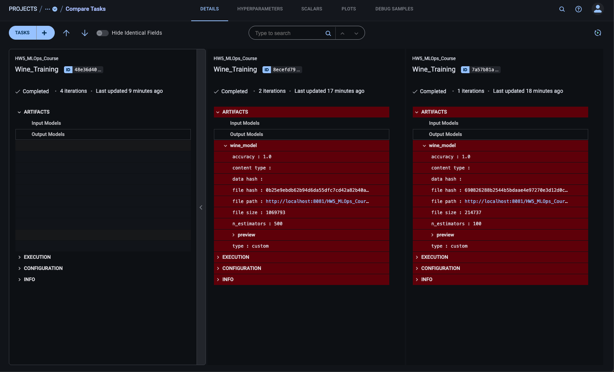

# Отчет

---

## 1. Настройка ClearML (3 балла)

**Реализация:**
*   Развернут локальный сервер ClearML через **Docker Compose**.
*   Настроена аутентификация клиента через `clearml.conf`.
*   Артефакты (модели) автоматически сохраняются в File Server (`output_uri=True`).

---

## 2. Трекинг экспериментов

**Реализация:**
*   Настроено автоматическое логирование через `ClearML Task`.
*   Добавлено явное логирование метрик (`Logger.report_scalar`) и параметров (`task.connect`).
*   **Сравнение экспериментов:** Проведены запуски с разным количеством эстиматоров.

---

## 3. Управление моделями (3 балла)

**Реализация:**
*   Использован `joblib` для сериализации модели.
*   Модели регистрируются в **Model Registry** с автоматическим версионированием.
*   Добавлены **метаданные** (Custom Metadata): в коде передается словарь с метриками (Accuracy) и конфигурацией, что позволяет выбирать лучшую модель без скачивания.
*   Настроено сохранение конфигурации окружения через `task.connect_configuration`.

---

## 4. Пайплайны (2 балла)

**Реализация:**
*   Создан модульный пайплайн с использованием декораторов `@PipelineDecorator`.
*   Логика ML вынесена в отдельный модуль `src/logic.py`, что позволяет переиспользовать код между одиночными запусками и пайплайном.
*   Пайплайн состоит из шагов: `data_step` -> `train_step` -> `eval_step`.
*   Включено кэширование шагов (`cache=True`), что ускоряет повторные запуски.

**Мониторинг и Уведомления:**
*   Мониторинг выполнения доступен через Web UI (граф выполнения).
*   **Уведомления:** Реализована программная проверка качества (`if acc < threshold`).

---

## 5. Воспроизводимость и Инженерные практики

*   Использован **uv** для управления зависимостями и генерации `uv.lock`.
